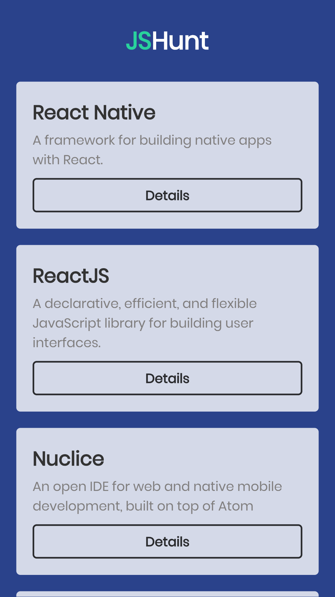

# JSHunt

An ReactJS project developed during the Rocketseat React course.

## Update on 11 feb 2019:

I decided to make a "remaster" :)

<b>Technically:</b> Clean code and UX/ UI improvements

### Before
 

### After
 

### Would U like to test?

Follow the steps below

If ( have_NODEJS_installed_on_your_computer ) {

    // In the project directory, execute the command:
    $ npm install       // (this may take a while)
    
    // After that, run:
    $ npm start       // (the application will start on localhost:3000)

} else {

    // Download Node.js via the link below]
    https://nodejs.org/pt-br/download/
    
}
